# FreshLink — Complete System Documentation

> Ghana agricultural marketplace connecting **buyers**, **farmers**, **transporters**, **investors**, and **admins** through a mobile-first React app, NestJS API, and USSD/SMS channels for users on basic phones.

**Version:** 0.1.0  
**Last updated:** July 2026  
**Repository:** `Fresh-Link/` monorepo

---

## Table of Contents

1. [Executive Summary](#1-executive-summary)
2. [System Overview](#2-system-overview)
3. [Technology Stack](#3-technology-stack)
4. [Repository Structure](#4-repository-structure)
5. [System Architecture](#5-system-architecture)
6. [Database Design](#6-database-design)
7. [Authentication & Authorization](#7-authentication--authorization)
8. [User Roles & Personas](#8-user-roles--personas)
9. [Application Sections (Complete)](#9-application-sections-complete)
10. [User Flows & Sequence Diagrams](#10-user-flows--sequence-diagrams)
11. [Backend API Reference](#11-backend-api-reference)
12. [Real-Time & Notifications](#12-real-time--notifications)
13. [Third-Party Integrations](#13-third-party-integrations)
14. [Mobile (Capacitor)](#14-mobile-capacitor)
15. [Internationalization (i18n)](#15-internationalization-i18n)
16. [Environment Variables](#16-environment-variables)
17. [Development Setup](#17-development-setup)
18. [Deployment & Production](#18-deployment--production)
19. [Testing Strategy](#19-testing-strategy)
20. [Security Considerations](#20-security-considerations)
21. [Known Gaps & Future Work](#21-known-gaps--future-work)

---

## 1. Executive Summary

FreshLink is a full-stack marketplace for fresh agricultural produce in Ghana. It enables:

- **Buyers** to browse, compare, cart, checkout (Paystack), track deliveries, and chat with farmers
- **Farmers** to list produce, manage orders, request transport, access knowledge content, seek funding, and withdraw earnings
- **Transporters** to accept delivery jobs, navigate routes, update GPS, and earn fees
- **Investors** to fund farmer requests via Paystack
- **Admins** to monitor users, orders, payments, disputes, and platform health
- **USSD users** on basic GSM phones to browse prices, check orders/wallet without mobile data
- **SMS OTP** for passwordless login via Africa's Talking

The system is designed for **low-connectivity environments** (USSD + offline-aware UI) while the smartphone app provides the full experience.

---

## 2. System Overview

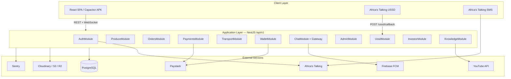

### High-Level Data Flow

| Actor | Primary channel | Auth | Core actions |
|-------|----------------|------|--------------|
| Buyer | App (web/APK) | Phone + OTP / password | Browse → cart → Paystack → track |
| Farmer | App | Phone + OTP / password | List produce → fulfill orders → wallet |
| Transport | App | Phone + OTP / password | Accept jobs → GPS → deliver |
| Investor | App | Phone + OTP / password | Browse funding → invest |
| Admin | App / browser | Phone + OTP | Moderate platform |
| Basic phone user | USSD `*384*XXXXX#` | Phone linked to account | Browse, wallet, orders (read-only) |

---

## 3. Technology Stack

### Frontend (`src/`)

| Layer | Technology |
|-------|------------|
| Framework | React 18 + TypeScript |
| Build | Vite |
| Routing | React Router v6 (**HashRouter** — required for Capacitor) |
| Styling | Tailwind CSS |
| State | Zustand (auth, cart, OTP session) |
| Server state | TanStack Query v5 (with persistence) |
| Forms | React Hook Form + Zod |
| Maps | Leaflet + react-leaflet |
| Charts | Recharts |
| i18n | i18next + react-i18next |
| Real-time | socket.io-client |
| Mobile | Capacitor 6 (Android; iOS dep ready) |
| Push (web) | Firebase SDK |
| Push (native) | @capacitor/push-notifications |
| Errors | @sentry/react |
| PDF | jsPDF (invoices) |

### Backend (`backend/`)

| Layer | Technology |
|-------|------------|
| Framework | NestJS 10 |
| ORM | Prisma 5 + PostgreSQL |
| Auth | Passport JWT + bcrypt |
| Validation | class-validator / class-transformer |
| API docs | Swagger/OpenAPI at `/api/docs` |
| WebSocket | @nestjs/platform-socket.io |
| File upload | Multer + Cloudinary / AWS S3 SDK |
| Push | firebase-admin |
| SMS | Africa's Talking REST API |
| Payments | Paystack REST + webhooks |
| Errors | @sentry/node |
| Rate limit | @nestjs/throttler |

---

## 4. Repository Structure

```
Fresh-Link/
├── src/                          # React frontend
│   ├── pages/                    # 71 route pages (7 folders)
│   │   ├── admin/                # 7 pages
│   │   ├── auth/                 # 8 pages
│   │   ├── buyer/                # 17 pages
│   │   ├── farmer/               # 13 pages
│   │   ├── investor/             # 2 pages
│   │   ├── shared/               # 13 pages
│   │   └── transport/            # 11 pages
│   ├── components/               # Shared UI (29 files)
│   │   ├── admin/                # AdminShell, AdminSubHeader
│   │   ├── buyer/                # Payment/delivery sheets
│   │   ├── chat/                 # Voice messages
│   │   ├── transport/            # TransportMap
│   │   ├── ui/                   # BottomNav, Button, loaders, etc.
│   │   └── wallet/               # Payout sheets
│   ├── lib/
│   │   ├── api.ts                # HTTP client + token refresh
│   │   ├── authStore.ts          # Zustand auth persistence
│   │   ├── cartStore.ts          # Cart state
│   │   ├── hooks/                # 25 custom hooks
│   │   ├── navTabs.ts            # Role-based bottom navigation
│   │   ├── socket.ts             # WebSocket client
│   │   ├── i18n.ts               # Translations
│   │   └── ussdConfig.ts         # USSD shortcode
│   ├── locales/                  # en, tw, ha, ee, ga
│   └── App.tsx                   # 77 routes + guards
│
├── backend/
│   ├── src/
│   │   ├── auth/                 # JWT, OTP, register
│   │   ├── users/                # Profiles, saved farmers
│   │   ├── produce/              # Listings CRUD
│   │   ├── orders/               # Order lifecycle
│   │   ├── payments/             # Paystack
│   │   ├── transport/            # Jobs + GPS
│   │   ├── wallet/               # Ledger + withdrawals
│   │   ├── chat/                 # REST + ChatGateway
│   │   ├── notifications/        # In-app + FCM
│   │   ├── storage/              # Uploads
│   │   ├── investor/             # Funding
│   │   ├── admin/                # Platform admin
│   │   ├── ussd/                 # AT USSD state machine
│   │   ├── sms/                  # AT SMS service
│   │   ├── knowledge/            # Articles + YouTube
│   │   ├── payment-methods/      # Saved payment labels
│   │   └── integrations/         # Status endpoints
│   ├── prisma/
│   │   └── schema.prisma         # Full DB schema
│   └── scripts/
│       └── test-at-sms.ts        # SMS test utility
│
├── android/                      # Capacitor Android project
├── public/                       # Static assets
├── capacitor.config.ts
├── DOCUMENTATION.md              # This file
└── README.md
```

---

## 5. System Architecture

### 5.1 Layered Architecture

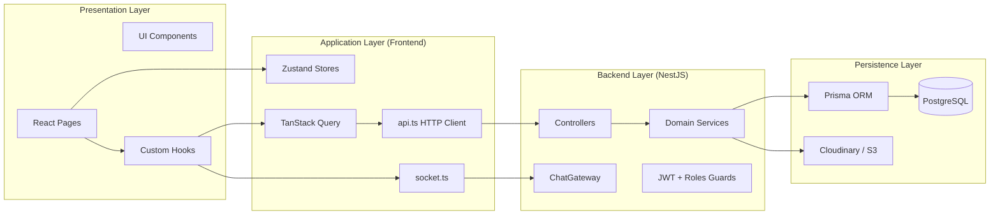

### 5.2 Request Lifecycle (Authenticated API Call)

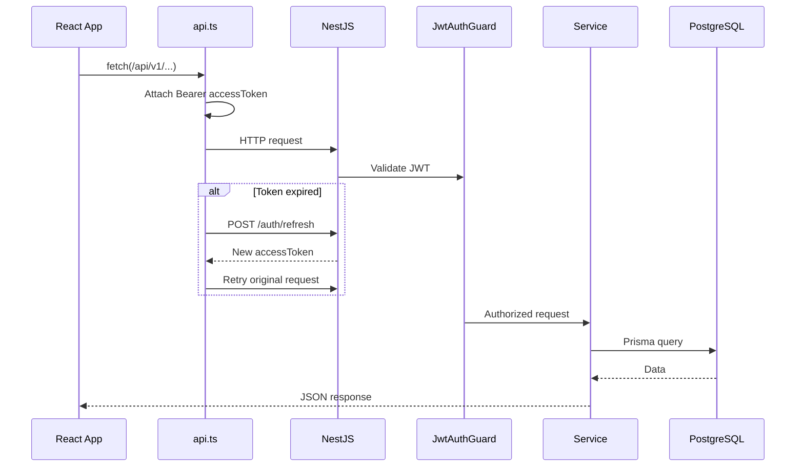

### 5.3 Route Guard Model (Frontend)

| Guard | Behavior |
|-------|----------|
| `ProtectedRoute` | Requires JWT; optional `roles[]`; redirects wrong role to home |
| `BuyerBrowseRoute` | Allows **guest** browsing; redirects logged-in non-buyers |
| Public routes | Splash, onboarding, login, USSD sim, legal pages |

**Role home routes:**

| Role | Home |
|------|------|
| buyer | `/buyer/home` |
| farmer | `/farmer/dashboard` |
| transport | `/transport/dashboard` |
| investor | `/investor/dashboard` |
| admin | `/admin/dashboard` |

### 5.4 Bottom Navigation (`navTabs.ts`)

| Role | Tabs |
|------|------|
| Buyer (incl. guest) | Home · Explore · Farmers · Cart |
| Farmer | Dashboard · Produce · Orders · Wallet |
| Transport | Home · Jobs · Earnings · Wallet |
| Admin | Dashboard · Users · Monitor · Reports |
| Investor | *(no bottom nav)* |

Messages FAB (bottom-right) appears for buyer, farmer, transport — hidden for admin/investor.

---

## 6. Database Design

### 6.1 Entity Relationship (Core)

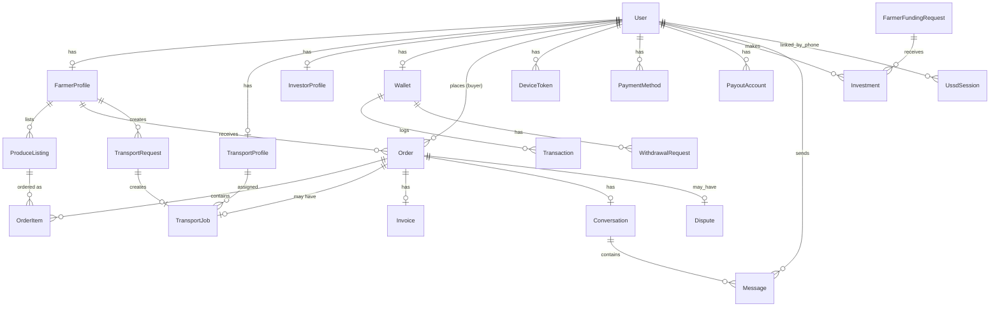

### 6.2 Key Models

| Model | Purpose |
|-------|---------|
| `User` | Central identity — phone (unique), role, verification |
| `FarmerProfile` | Farm metadata, location, ratings |
| `TransportProfile` | Vehicle info, availability, GPS |
| `ProduceListing` | Title, price, unit, stock, images, status |
| `Order` | Buyer-farmer transaction with status lifecycle |
| `OrderItem` | Line items with quantity and unit price |
| `TransportJob` | Pickup → delivery assignment for transporter |
| `Wallet` | Balance per farmer/transport/investor |
| `Transaction` | Immutable ledger entries |
| `Conversation` / `Message` | Buyer↔farmer and delivery chat |
| `Notification` | In-app notification records |
| `Otp` | 6-digit codes with expiry and purpose |
| `UssdSession` | AT USSD state machine persistence |
| `FarmerFundingRequest` | Crowdfunding goals |
| `Investment` | Investor pledges |
| `Dispute` | Order disputes for admin resolution |
| `KnowledgeArticle` | Farmer education content |

### 6.3 Order Status Lifecycle

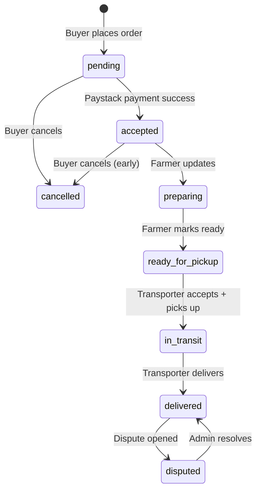

**Business rules:**
- Fixed delivery fee: **₵15**
- Platform fee on farmer credit: **5%** (farmer receives 95% of order total)
- Stock decremented on order creation; restored on cancel
- `ready_for_pickup` auto-creates a `TransportJob`

### 6.4 Transport Job Lifecycle

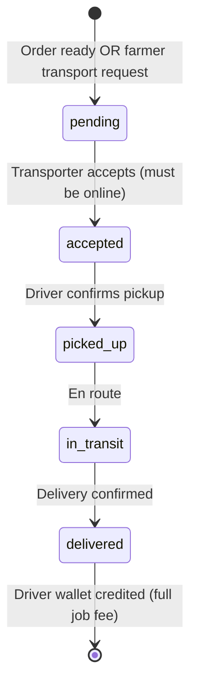

---

## 7. Authentication & Authorization

### 7.1 Auth Methods

| Method | Flow |
|--------|------|
| **OTP (primary mobile)** | Phone → `POST /auth/otp/send` → SMS PIN → `POST /auth/otp/verify` → JWT |
| **Password** | Phone + password → `POST /auth/login` → JWT |
| **Registration** | Register → OTP verify → `isVerified=true` |
| **Password reset** | Forgot → OTP → reset with code |
| **Admin bootstrap** | `ADMIN_PHONES` env auto-promotes on boot |
| **Admin register** | `POST /auth/admin/register` + `ADMIN_SETUP_CODE` |

### 7.2 OTP Flow

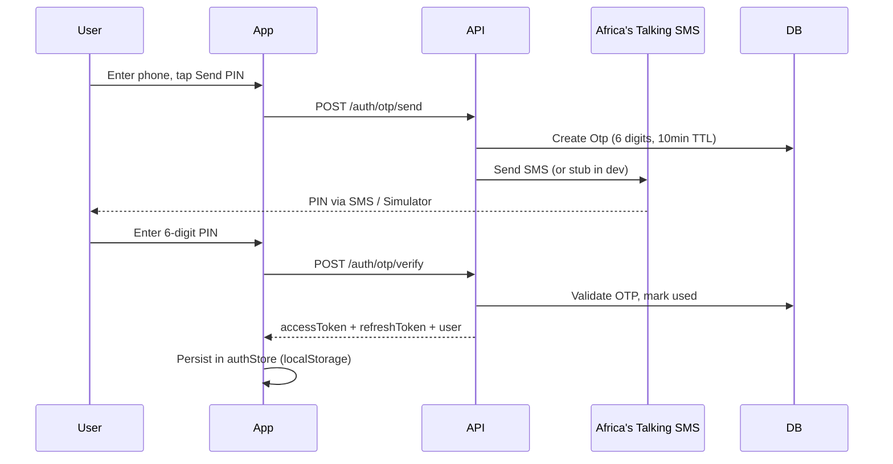

**Dev fallback:** `GET /auth/dev/otp/:phone` (non-production only)

### 7.3 JWT Tokens

| Token | Secret env | Default TTL | Payload |
|-------|-----------|-------------|---------|
| Access | `JWT_ACCESS_SECRET` | 15m (configurable) | `{ sub, phone, role }` |
| Refresh | `JWT_REFRESH_SECRET` | 30d | `{ sub, phone, role }` |

Frontend auto-refreshes on 401 via `api.ts`.

### 7.4 Backend Authorization

- Global `JwtAuthGuard` — all routes unless `@Public()`
- `RolesGuard` + `@Roles('farmer')` etc.
- `AdminController` — class-level `@Roles('admin')`

---

## 8. User Roles & Personas

### 8.1 Buyer

**Goal:** Find fresh produce, compare prices, order, track delivery, communicate.

**Access:** Guest browse allowed; checkout requires login.

**Key screens:** Home, Search, Product Detail, Cart, Checkout, Orders, Tracking, Favorites, Saved Farmers, Map, Compare, Chat, Notifications, Invoice.

### 8.2 Farmer

**Goal:** List produce, fulfill orders, manage earnings, grow business, learn, seek funding.

**Key screens:** Dashboard, My Produce (add/edit), Order Requests, Wallet, Reviews, Insights, Knowledge Hub, Video Player, Funding, Request Transport, Notifications, Chat.

### 8.3 Transport

**Goal:** Find delivery jobs, navigate, complete deliveries, earn fees.

**Key screens:** Dashboard, Available Jobs, Active Delivery, Live Navigation, Earnings, Completed Deliveries, Vehicle Profile, Availability toggle, Wallet, Ratings, Notifications, Chat.

### 8.4 Investor

**Goal:** Discover farmer funding opportunities and invest.

**Key screens:** Dashboard (browse requests), Invest (Paystack checkout). No bottom nav.

### 8.5 Admin

**Goal:** Platform oversight, user moderation, dispute resolution, revenue analytics.

**Key screens:** Dashboard (stats), User Management, Marketplace Monitor, Reports, Support, Payments. Uses green `AdminShell` UI.

**Creation:** `/#/admin/register` with `ADMIN_SETUP_CODE` from backend `.env`.

### 8.6 USSD User (Basic Phone)

**Goal:** Check prices, orders, wallet without smartphone/data.

**Channel:** Dial `*384*45670#` (sandbox) → Africa's Talking → FreshLink backend.

**Capabilities:** Browse produce (read-only), view orders, wallet balance, farmer listings, transport jobs. **Ordering deferred to app.**

---

## 9. Application Sections (Complete)

Every page and route in the application, grouped by module.

### 9.1 Auth & Onboarding (8 pages)

| Route | Page | Description |
|-------|------|-------------|
| `/` | `Splash` | App launch animation; routes to onboarding or home |
| `/onboarding` | `Onboarding` | First-run feature carousel |
| `/language` | `LanguageSelect` | Pick language (en, tw, ha, ee, ga) |
| `/role-select` | `RoleSelect` | Choose buyer/farmer/transport/investor; links to USSD |
| `/login` | `Login` | Phone entry → Send PIN (OTP flow) |
| `/register` | `Register` | Name, phone, role, password → OTP verify |
| `/forgot-password` | `ForgotPassword` | Phone → OTP reset flow |
| `/otp` | `OtpVerification` | 6-digit numeric PIN entry |

### 9.2 Buyer Module (17 pages)

#### Browse (guest + buyer)

| Route | Page | Description |
|-------|------|-------------|
| `/buyer/home` | `Home` | Featured produce, categories, search entry |
| `/buyer/search` | `SearchFilters` | Filter by category, price, location |
| `/buyer/product/:id` | `ProductDetail` | Listing detail, add to cart, favorite |
| `/buyer/farmer/:id` | `FarmerProfile` | Farmer public profile + their listings |
| `/buyer/compare` | `PriceCompare` | Side-by-side price comparison |
| `/buyer/map` | `MapView` | Leaflet map of farmers/listings |
| `/buyer/cart` | `Cart` | Cart items, quantities, proceed to checkout |
| `/buyer/farmers` | `BrowseFarmers` | Directory of farmers |

#### Authenticated buyer

| Route | Page | Description |
|-------|------|-------------|
| `/buyer/checkout` | `Checkout` | Delivery address, Paystack payment |
| `/buyer/orders` | `OrderHistory` | Past and active orders |
| `/buyer/favorites` | `Favorites` | Saved produce listings |
| `/buyer/notifications` | `BuyerNotifications` | Order/payment alerts |
| `/buyer/saved` | `SavedFarmers` | Followed farmers |
| `/buyer/tracking/:id` | `OrderTracking` | Live order status + map |
| `/buyer/messages` | `ChatInbox` | Conversation list |
| `/buyer/invoice/:id` | `Invoice` | PDF invoice generation |

#### Chat (buyer + farmer)

| Route | Page | Description |
|-------|------|-------------|
| `/buyer/chat/:id` | `Chat` | Real-time messaging thread |
| `/buyer/chat/:id/contact` | `ChatContactProfile` | Contact info (multi-role) |

### 9.3 Farmer Module (13 pages)

| Route | Page | Description |
|-------|------|-------------|
| `/farmer/dashboard` | `Dashboard` | Stats, recent orders, quick actions |
| `/farmer/produce` | `MyProduce` | List of own listings |
| `/farmer/produce/add` | `AddProduce` | Create listing + photo upload |
| `/farmer/produce/edit/:id` | `EditProduce` | Edit listing |
| `/farmer/orders` | `OrderRequests` | Incoming orders, status updates |
| `/farmer/wallet` | `Wallet` | Balance, transactions, withdraw |
| `/farmer/reviews` | `Reviews` | Buyer reviews received |
| `/farmer/notifications` | `Notifications` | Order/job alerts |
| `/farmer/messages` | `ChatInbox` | Buyer conversations |
| `/farmer/transport/request` | `RequestTransport` | Standalone transport request |
| `/farmer/insights` | `Insights` | Demand analytics chart |
| `/farmer/knowledge` | `KnowledgeHub` | Articles + YouTube videos |
| `/farmer/knowledge/video/:id` | `VideoPlayer` | Embedded video player |
| `/farmer/funding` | `FarmerFunding` | Create/manage funding requests |
| `/farmer/chat/:id` | `Chat` | Buyer chat thread |

### 9.4 Transport Module (11 pages)

| Route | Page | Description |
|-------|------|-------------|
| `/transport/dashboard` | `Dashboard` | Active job summary, availability |
| `/transport/jobs` | `AvailableJobs` | Open jobs board |
| `/transport/delivery/:id` | `ActiveDelivery` | Current delivery management |
| `/transport/earnings` | `Earnings` | Earnings history |
| `/transport/completed` | `CompletedDeliveries` | Past deliveries |
| `/transport/vehicle` | `VehicleProfile` | Vehicle type, plate, photo |
| `/transport/availability` | `Availability` | Online/offline toggle |
| `/transport/wallet` | `TransportWallet` | Balance + withdrawals |
| `/transport/ratings` | `TransportRatings` | Reviews from buyers |
| `/transport/navigation/:id` | `LiveNavigation` | GPS navigation for delivery |
| `/transport/notifications` | `TransportNotifications` | Job alerts |
| `/transport/messages` | `ChatInbox` | Delivery chat |
| `/transport/chat/:id` | `Chat` | Chat thread |

### 9.5 Investor Module (2 pages)

| Route | Page | Description |
|-------|------|-------------|
| `/investor/dashboard` | `Dashboard` | Browse open funding requests |
| `/investor/invest/:id` | `Invest` | Investment amount + Paystack |

### 9.6 Admin Module (7 pages)

| Route | Page | Description |
|-------|------|-------------|
| `/admin/register` | `Register` | Create admin (setup code) |
| `/admin/dashboard` | `Dashboard` | Platform stats, revenue, disputes |
| `/admin/users` | `UserManagement` | List, search, suspend/activate |
| `/admin/monitor` | `MarketplaceMonitor` | Live orders + marketplace view |
| `/admin/reports` | `Reports` | Analytics reports |
| `/admin/support` | `Support` | Support tickets / disputes |
| `/admin/payments` | `Payments` | Transaction monitoring |

Wrapped in `AdminShell` + `ErrorBoundary` for crash protection.

### 9.7 Shared / Settings (13 pages)

| Route | Page | Access | Description |
|-------|------|--------|-------------|
| `/settings` | `Settings` | Auth | Settings hub |
| `/settings/profile` | `ProfileSettings` | Auth | Name, avatar, phone |
| `/settings/payments` | `PaymentSettings` | Auth | Saved payment methods |
| `/settings/security` | `SecuritySettings` | Auth | Password change |
| `/settings/notifications` | `NotificationSettings` | Auth | Notification prefs |
| `/settings/addresses` | `AddressBookSettings` | buyer | Delivery addresses |
| `/settings/farm-profile` | `FarmProfileSettings` | farmer | Farm details |
| `/settings/help` | `HelpCenter` | Public | FAQ + USSD link |
| `/settings/about` | `About` | Public | App info |
| `/settings/terms` | `Terms` | Public | Terms of service |
| `/settings/privacy` | `Privacy` | Public | Privacy policy |
| `/ussd` | `UssdSimulation` | Public | In-app USSD keypad simulator |
| `/buyer/chat/:id/contact` | `ChatContactProfile` | Multi | Shared contact view |

### 9.8 Frontend Components (Key)

| Component | Purpose |
|-----------|---------|
| `ProtectedRoute` | Auth + role guards |
| `ErrorBoundary` | Catches React crashes (admin routes) |
| `BottomNav` | Role-based tab bar + messages FAB |
| `SettingsMenuSheet` | Hamburger menu (profile, settings, logout, USSD) |
| `AdminShell` / `AdminSubHeader` | Admin layout wrapper |
| `NotificationProvider` | Push + realtime notification wiring |
| `OfflineBanner` | Network status indicator |
| `LocationMapPicker` | Lat/lng picker for listings |
| `TransportMap` | Live driver map |
| `VoiceMessage` | Audio messages in chat |
| `PayoutSheets` | MoMo/bank withdrawal UI |

### 9.9 Frontend Hooks (25)

| Hook | Domain |
|------|--------|
| `useAuth` | Register, login, OTP, password reset |
| `useAuthBootstrap` | Session hydration on app load |
| `useProduce` | Listings, favorites, farmers |
| `useOrders` | Orders, payments, analytics |
| `useWallet` | Balance, payouts, withdrawals |
| `useTransport` | Jobs, GPS, availability |
| `useChat` | Conversations, messages, typing |
| `useAdmin` | Stats, users, disputes |
| `useInvestor` | Funding, investments |
| `useFunding` | Farmer funding requests |
| `useKnowledge` | Articles, YouTube |
| `useNotifications` | In-app notifications |
| `useRealtimeNotifications` | Socket notification stream |
| `usePushNotifications` | FCM registration |
| `useUssd` | USSD simulator API |
| `usePaymentMethods` | Saved methods |
| `useSavedFarmers` | Saved farmers |
| `useStorage` | File uploads |
| `useNativeApp` | Splash, status bar, back button |
| `useNativeCamera` | Capacitor camera |
| `useHaptics` | Haptic feedback |
| `useOnlineStatus` | Network detection |
| `useUpdateAvatar` | Avatar upload |
| `useVoiceRecorder` | Chat voice notes |
| `useTypewriter` | UI animation |

---

## 10. User Flows & Sequence Diagrams

### 10.1 Buyer Purchase Flow

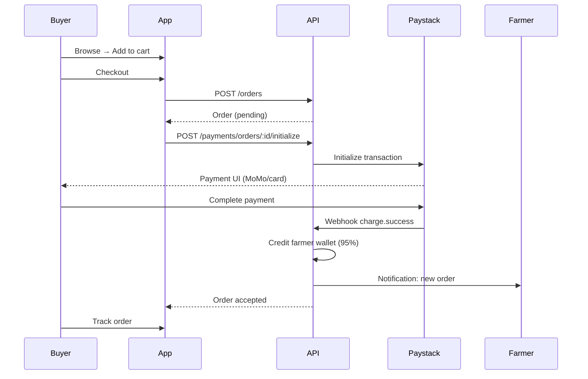

### 10.2 Farmer Order Fulfillment

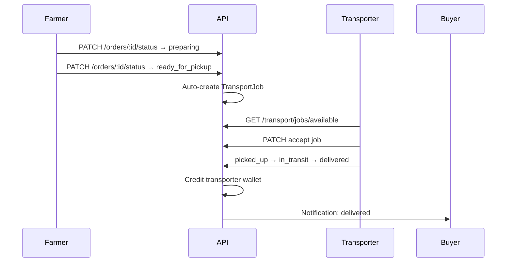

### 10.3 USSD Session Flow

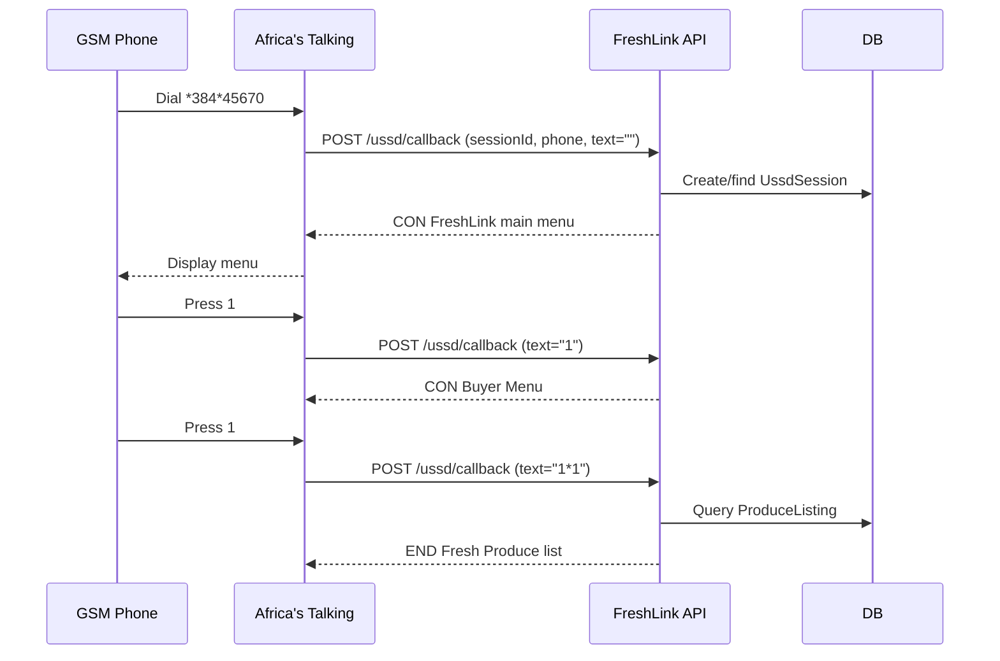

**USSD menu tree:**

```
FreshLink
├── 1 Buyer Menu
│   ├── 1 Browse Produce (read-only)
│   ├── 2 My Orders
│   ├── 3 Track Order (enter ID)
│   └── 0 Back
├── 2 Farmer Menu
│   ├── 1 My Listings
│   ├── 2 Order Requests
│   ├── 3 My Wallet
│   ├── 4 Track Order
│   └── 0 Back
├── 3 Transport Menu
│   ├── 1 Available Jobs
│   ├── 2 My Active Job
│   ├── 3 Earnings
│   └── 0 Back
├── 4 My Orders
└── 5 Wallet Balance
```

### 10.4 Investor Flow

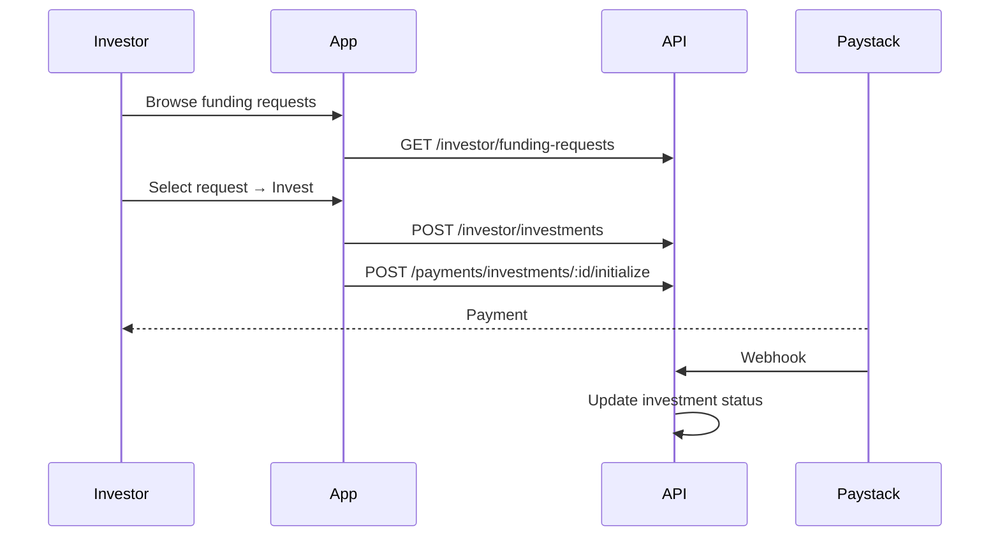

### 10.5 Chat Flow

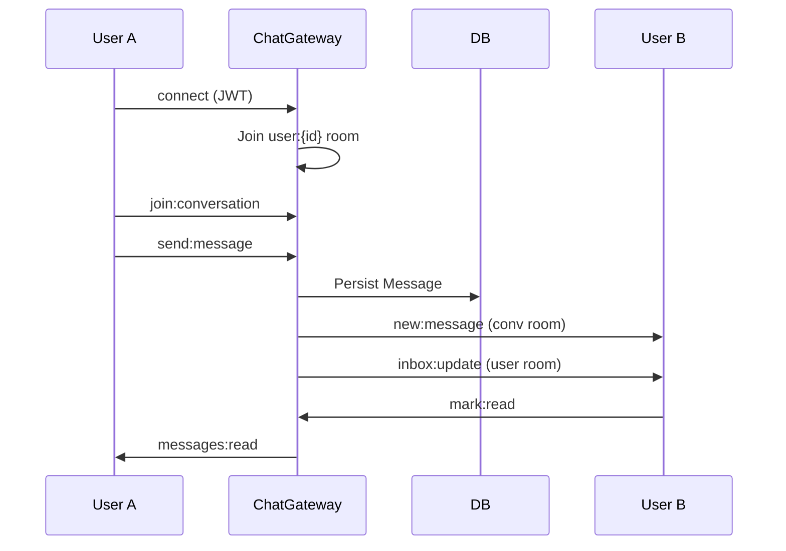

---

## 11. Backend API Reference

**Base URL:** `http://<host>:<port>/api/v1`  
**Swagger:** `/api/docs`  
**Auth:** `Authorization: Bearer <accessToken>` unless marked public.

### Module Summary (~100 endpoints)

| Module | Prefix | Key endpoints |
|--------|--------|---------------|
| Auth | `/auth` | register, login, otp/send, otp/verify, refresh, me |
| Users | `/users` | me, profiles, farmers, saved-farmers |
| Produce | `/produce` | browse, CRUD, favorites, compare, trends |
| Orders | `/orders` | create, buyer/farmer lists, status, cancel, invoice, reviews |
| Payments | `/payments` | initialize order/investment, Paystack webhook |
| Transport | `/transport` | jobs, accept, status, location, availability, requests |
| Wallet | `/wallet` | balance, transactions, payout-accounts, withdraw |
| Chat | `/chat` | conversations, messages |
| Notifications | `/notifications` | list, mark read |
| Storage | `/storage` | upload, presign, status |
| Investor | `/investor` | funding-requests, investments |
| Admin | `/admin` | stats, users, orders, transactions, disputes, revenue |
| USSD | `/ussd` | config, callback, simulate |
| Knowledge | `/knowledge` | articles, categories |
| Payment Methods | `/payment-methods` | CRUD saved methods |
| Integrations | `/integrations` | africas-talking/status |

**Rate limits:** 60 req/min global; OTP endpoints 3/min.

---

## 12. Real-Time & Notifications

### 12.1 WebSocket (Socket.IO)

**Connection:** JWT in `auth.token` handshake.

| Client → Server | Server → Client |
|----------------|-----------------|
| `join:conversation` | `new:message` |
| `send:message` | `inbox:update` |
| `mark:read` | `messages:read` |
| `typing:start/stop` | `user:typing` |
| | `notification:new` |
| | `order:update` / `job:update` |

### 12.2 Push Notifications

| Platform | Mechanism |
|----------|-----------|
| Web | Firebase SDK → FCM |
| Android APK | Capacitor PushNotifications → device token → `POST /users/me/device-token` |
| Backend | `firebase-admin` sends to registered tokens |

### 12.3 In-App Notifications

Created on order status changes, transport events, payments. Stored in `Notification` table. Delivered via WebSocket + optional FCM.

---

## 13. Third-Party Integrations

### 13.1 Africa's Talking

| Service | Endpoint | Env vars | Status |
|---------|----------|----------|--------|
| SMS (OTP) | `api.sandbox.africastalking.com` (sandbox) | `AFRICASTALKING_API_KEY`, `USERNAME` | ✅ Integrated |
| USSD | `POST /ussd/callback` | `AFRICASTALKING_SHORTCODE` | ✅ Integrated (sandbox `*384*45670#`) |

**Sandbox SMS:** Messages appear in AT Simulator, not on real phone.  
**Sandbox USSD:** Requires public callback URL (ngrok for local dev).

### 13.2 Paystack

| Feature | Implementation |
|---------|----------------|
| Order checkout | `POST /payments/orders/:id/initialize` |
| Investment checkout | `POST /payments/investments/:id/initialize` |
| Webhooks | `POST /payments/webhook/paystack` (HMAC-SHA512) |
| Withdrawals | Paystack Transfers API via `PaystackTransfersService` |
| Test mode | `WALLET_SIMULATE_WITHDRAWALS=true` for simulated payouts |

### 13.3 Storage (priority order)

1. **Cloudinary** — image optimization (recommended)
2. **AWS S3 / Cloudflare R2** — object storage + presigned uploads
3. **Local disk** — `backend/public/uploads/` fallback

### 13.4 Other

| Service | Purpose |
|---------|---------|
| Firebase Admin | Push notifications |
| YouTube Data API | Knowledge Hub video search (optional) |
| Sentry | Error tracking (frontend + backend) |

---

## 14. Mobile (Capacitor)

### Configuration (`capacitor.config.ts`)

| Setting | Value |
|---------|-------|
| appId | `com.freshlink.app` |
| webDir | `dist` |
| androidScheme | `http` (avoids mixed-content with local API) |

### Build & Deploy

```bash
npm run build
npm run cap:sync
npm run cap:open:android   # Android Studio
npm run cap:run:android    # Direct to device
```

### Device API Access

| Concern | Solution |
|---------|----------|
| API URL on device | `VITE_API_BASE_URL_NATIVE` + `adb reverse tcp:3001 tcp:3001` |
| Camera | `useNativeCamera` (Capacitor Camera) |
| Push | `usePushNotifications` |
| Back button | `useNativeApp` (Android) |
| Haptics | `useHaptics` |
| Offline | `OfflineBanner` + TanStack Query persistence |

---

## 15. Internationalization (i18n)

**Languages:** English (`en`), Twi (`tw`), Hausa (`ha`), Ewe (`ee`), Ga (`ga`)

**Files:** `src/locales/{lang}/translation.json`  
**Config:** `src/lib/i18n.ts` — browser language detection + `LanguageSelect` page  
**Usage:** `useTranslation()` hook throughout UI

---

## 16. Environment Variables

See [backend/.env.example](backend/.env.example) and [.env.example](.env.example) for full lists.

### Critical for production

| Variable | Layer | Required |
|----------|-------|----------|
| `DATABASE_URL` | Backend | Yes |
| `JWT_ACCESS_SECRET` / `JWT_REFRESH_SECRET` | Backend | Yes |
| `AFRICASTALKING_API_KEY` | Backend | For real SMS |
| `AFRICASTALKING_SHORTCODE` | Backend | For USSD |
| `PAYSTACK_SECRET_KEY` | Backend | For payments |
| `VITE_API_BASE_URL` | Frontend (build-time) | Yes |
| `VITE_PAYSTACK_PUBLIC_KEY` | Frontend (build-time) | For checkout |

---

## 17. Development Setup

### Prerequisites

- Node.js 20+
- PostgreSQL 15+
- (Optional) ngrok account for USSD testing
- (Optional) Africa's Talking sandbox account
- (Optional) Android Studio + device for APK testing

### Quick Start

```bash
# Frontend
npm install && cp .env.example .env && npm run dev

# Backend
cd backend && npm install && cp .env.example .env
npm run prisma:generate && npm run prisma:migrate
PORT=3001 npm run start:dev

# Phone testing
adb reverse tcp:3001 tcp:3001
npm run build && npm run cap:sync && cd android && ./gradlew assembleDebug
```

### USSD Local Testing

```bash
ngrok config add-authtoken <token>
ngrok http 3001
# Set AT callback: https://<ngrok-url>/api/v1/ussd/callback
# Test via AT Sandbox → Launch Simulator
```

### SMS Testing

```bash
cd backend && npm run test:sms -- +233XXXXXXXXX
# Dev OTP: curl http://localhost:3001/api/v1/auth/dev/otp/+233XXXXXXXXX
```

---

## 18. Deployment & Production

### Recommended Architecture

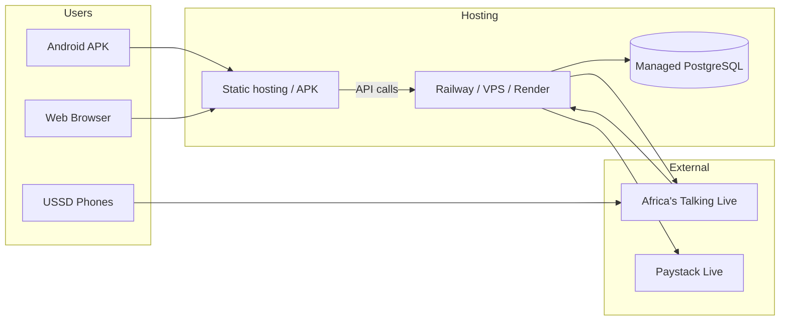

### Production Checklist

- [ ] Deploy backend with `NODE_ENV=production`
- [ ] Set all secrets on host (not in repo)
- [ ] Run `prisma migrate deploy`
- [ ] Build frontend with production `VITE_*` URLs
- [ ] Switch AT from sandbox to live credentials
- [ ] Set USSD callback to production API URL (not ngrok)
- [ ] Configure Paystack live keys + webhook URL
- [ ] Enable Sentry DSNs
- [ ] Change `ADMIN_SETUP_CODE` from default
- [ ] Disable `GET /auth/dev/otp` (auto-disabled in production)

---

## 19. Testing Strategy

| Layer | Approach |
|-------|----------|
| API | Swagger UI at `/api/docs`; manual curl/Postman |
| USSD | AT Sandbox Simulator + `POST /ussd/simulate` |
| SMS | `npm run test:sms` + AT Simulator SMS tab |
| Frontend | In-app USSD simulator at `/#/ussd` |
| Mobile | APK on device + `adb reverse` |
| Payments | Paystack test keys + test cards/MoMo |
| E2E | Manual role-based flows per section above |

---

## 20. Security Considerations

| Area | Implementation |
|------|----------------|
| Passwords | bcrypt (12 rounds) |
| API auth | JWT Bearer + refresh rotation |
| RBAC | NestJS `@Roles()` guard |
| OTP | 6-digit, 10-min expiry, rate-limited |
| Webhooks | Paystack HMAC verification |
| CORS | Whitelist localhost, Capacitor, LAN IPs |
| File upload | 10MB limit, image/audio MIME checks |
| Admin creation | `ADMIN_SETUP_CODE` gate |
| Secrets | `.env` gitignored; never commit keys |
| Throttling | Global + OTP-specific limits |

---

## 21. Known Gaps & Future Work

| Item | Status | Notes |
|------|--------|-------|
| Cart API | Schema exists, no backend module | Frontend uses `cartStore` client-side |
| USSD ordering | Not implemented | Browse-only by design |
| WhatsApp (AT) | Not integrated | Optional notifications channel |
| Investment disbursement | Partial | Webhook updates status; farmer wallet credit TBD |
| iOS project | Dependency only | Run `npx cap add ios` |
| Admin role change API | Service exists | No controller route exposed |
| Production SMS | Sandbox only | Needs live AT account for real phone delivery |
| Server-side cart sync | Future | Would need Cart module + endpoints |

---

## Appendix A: Route Index (77 routes)

<details>
<summary>Click to expand full route list</summary>

**Public:** `/`, `/onboarding`, `/language`, `/role-select`, `/login`, `/register`, `/forgot-password`, `/otp`, `/ussd`, `/admin/register`, `/settings/help`, `/settings/about`, `/settings/terms`, `/settings/privacy`

**Buyer browse:** `/buyer/home`, `/buyer/search`, `/buyer/product/:id`, `/buyer/farmer/:id`, `/buyer/compare`, `/buyer/map`, `/buyer/cart`, `/buyer/farmers`

**Buyer auth:** `/buyer/checkout`, `/buyer/orders`, `/buyer/favorites`, `/buyer/notifications`, `/buyer/saved`, `/buyer/tracking/:id`, `/buyer/messages`, `/buyer/invoice/:id`, `/buyer/chat/:id`, `/buyer/chat/:id/contact`

**Farmer:** `/farmer/dashboard`, `/farmer/produce`, `/farmer/produce/add`, `/farmer/produce/edit/:id`, `/farmer/orders`, `/farmer/wallet`, `/farmer/reviews`, `/farmer/notifications`, `/farmer/messages`, `/farmer/transport/request`, `/farmer/insights`, `/farmer/knowledge`, `/farmer/knowledge/video/:id`, `/farmer/funding`, `/farmer/chat/:id`, `/farmer/chat/:id/contact`

**Transport:** `/transport/dashboard`, `/transport/jobs`, `/transport/delivery/:id`, `/transport/earnings`, `/transport/completed`, `/transport/vehicle`, `/transport/availability`, `/transport/wallet`, `/transport/ratings`, `/transport/navigation/:id`, `/transport/messages`, `/transport/notifications`, `/transport/chat/:id`, `/transport/chat/:id/contact`

**Investor:** `/investor/dashboard`, `/investor/invest/:id`

**Admin:** `/admin/dashboard`, `/admin/users`, `/admin/monitor`, `/admin/reports`, `/admin/support`, `/admin/payments`

**Settings:** `/settings`, `/settings/profile`, `/settings/payments`, `/settings/security`, `/settings/notifications`, `/settings/addresses`, `/settings/farm-profile`

</details>

---

## Appendix B: Test Accounts (Development)

| Role | Phone | Notes |
|------|-------|-------|
| Admin | `+233200000001` | PIN login; `ADMIN_SETUP_CODE` for register |
| Farmer (karim) | `+233598730049` | `0598730049` local format |
| USSD shortcode | `*384*45670#` | AT Sandbox channel |

---

*This document is the authoritative reference for FreshLink system design. For quick setup, see [README.md](README.md).*
