<div align="center">

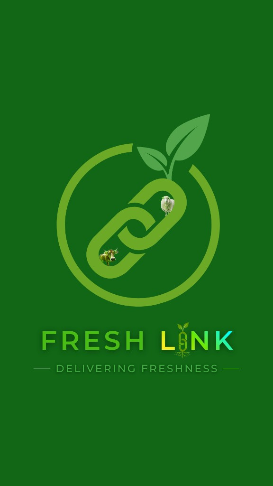

# FreshLink

**Ghana's Digital Agricultural Marketplace**

Connecting farmers, buyers, transporters, investors, and administrators through a mobile-first platform — with USSD & SMS access for users on basic phones.

[](https://fresh-link-weld.vercel.app)
[](https://fresh-link-production.up.railway.app/api/docs)
[](https://fresh-link-production.up.railway.app/api/docs)
[](https://fresh-link-weld.vercel.app)

</div>

---

## Table of Contents

1. [What FreshLink Does](#1-what-freshlink-does)
2. [User Stories](#2-user-stories)
3. [System Architecture](#3-system-architecture)
4. [Real-Time Data Flow](#4-real-time-data-flow)
5. [Database Schema](#5-database-schema)
6. [App Screenshots & Flows](#6-app-screenshots--flows)
7. [New Features (v2)](#7-new-features-v2)
8. [Tech Stack](#8-tech-stack)
9. [Application Map](#9-application-map)
10. [Key User Flows](#10-key-user-flows)
11. [Deployment](#11-deployment)
12. [Environment Variables](#12-environment-variables)
13. [Local Development](#13-local-development)
14. [Capacitor / APK Build](#14-capacitor--apk-build)
15. [Security](#15-security)
16. [Development Status](#16-development-status)

---

## 1. What FreshLink Does

FreshLink is an end-to-end agricultural marketplace platform built for Ghana that digitises the entire supply chain from farm gate to buyer's table. Every stakeholder — whether on a smartphone or a basic feature phone — has a dedicated, role-specific interface.

| Role | Core Capabilities |
|------|-------------------|
| **Buyer** | Browse fresh produce on a map, add to cart, pay via Paystack (MoMo / card), track delivery in real-time, chat with farmers, save favourites |
| **Farmer** | List produce with photos, manage orders, receive payments into a wallet, request transport, view AI-powered crop health scans, access knowledge hub with farming tutorials, apply for investor funding |
| **Transporter** | Accept delivery jobs with GPS navigation, earn per job, manage availability and vehicle profile, view ratings and earnings history |
| **Investor** | Browse farmer funding requests, invest directly via Paystack, track portfolio |
| **Admin** | Full platform oversight — users, marketplace listings, payments, disputes, reports, support tickets |
| **USSD** | Browse prices and order status on any GSM phone via `*384*45670#` (Africa's Talking) |
| **SMS** | OTP-based authentication via Africa's Talking SMS — no internet required to log in |

---

## 2. User Stories

### Buyer Stories

> *"As a buyer, I want to browse fresh produce from verified local farmers so I can make informed purchasing decisions."*

> *"As a buyer, I want to pay securely with Mobile Money or card through Paystack so I don't have to handle cash."*

> *"As a buyer, I want to track my delivery on a live map so I know exactly when my order will arrive."*

> *"As a buyer, I want to compare produce from multiple farmers side-by-side so I can find the best value."*

> *"As a buyer, I want to save my favourite farmers so I can reorder from them quickly."*

> *"As a buyer, I want to chat directly with a farmer to ask about freshness, quantity, or custom orders."*

> *"As a buyer on a basic phone, I want to browse produce prices via USSD so I can participate even without a smartphone."*

---

### Farmer Stories

> *"As a farmer, I want to list my produce with photos and prices so buyers across Ghana can discover my farm."*

> *"As a farmer, I want my earnings automatically credited to my wallet after delivery so I get paid without chasing buyers."*

> *"As a farmer, I want to scan my crops with my phone camera and get an AI-powered disease diagnosis so I can act quickly before losing yield."*

> *"As a farmer, I want to chat with the Gemini AI assistant about farming best practices, pest control, and crop recommendations."*

> *"As a farmer, I want to request a transporter for my produce so I don't have to arrange logistics myself."*

> *"As a farmer, I want to access a knowledge hub with farming videos and articles in my language so I can improve my skills."*

> *"As a farmer, I want to apply for investor funding so I can expand my farm without bank loans."*

> *"As a farmer, I want to see sales insights (daily/weekly/monthly) so I can make better business decisions."*

> *"As a farmer, I want to receive push notifications when a buyer places an order so I can respond quickly."*

---

### Transporter Stories

> *"As a transporter, I want to see available delivery jobs near me so I can pick up work efficiently."*

> *"As a transporter, I want in-app GPS navigation to the pickup and drop-off points so I don't get lost."*

> *"As a transporter, I want to toggle my availability so I only receive jobs when I'm ready to work."*

> *"As a transporter, I want a clear earnings history so I can track my income."*

> *"As a transporter, I want buyers to be able to rate me so I can build a trusted reputation."*

---

### Investor Stories

> *"As an investor, I want to browse verified farmer funding requests so I can choose projects that match my goals."*

> *"As an investor, I want to invest securely via Paystack so my transactions are protected."*

> *"As an investor, I want to track which farms I've funded and their status so I stay informed."*

---

### Admin Stories

> *"As an admin, I want a real-time dashboard showing platform metrics so I can monitor health at a glance."*

> *"As an admin, I want to manage all users (verify, suspend, promote) so I maintain platform integrity."*

> *"As an admin, I want to monitor all marketplace listings and payments so I can spot fraud or disputes."*

> *"As an admin, I want to generate exportable reports so I can make data-driven decisions."*

---

## 3. System Architecture

```mermaid
flowchart TB
  subgraph clients["📱 Clients"]
    App["React PWA\n(Vercel)\nfresh-link-weld.vercel.app"]
    APK["Android APK\n(Capacitor 6)\ncom.freshlink.app"]
    USSD["USSD\n*384*45670#\nBasic GSM Phones"]
  end

  subgraph api["⚙️ NestJS API (Railway)"]
    direction TB
    Auth["🔐 Auth\nJWT + OTP"]
    Produce["🌽 Produce\nListings & Search"]
    Orders["📦 Orders\nLifecycle Management"]
    Pay["💳 Payments\nPaystack Webhooks"]
    Transport["🚛 Transport\nJobs & GPS"]
    Wallet["💰 Wallet\nEarnings & Payouts"]
    Chat["💬 Chat\nWebSocket / Socket.IO"]
    CropScan["🌿 Crop Scan\nGemini Vision AI"]
    GeminiChat["🤖 Gemini Chat\nAg. AI Assistant"]
    Notif["🔔 Notifications\nFCM Push"]
    Investor["📈 Investor\nFunding Requests"]
    Knowledge["📚 Knowledge\nHub Articles"]
    Admin["🛡️ Admin\nPlatform Oversight"]
    USSD_GW["📟 USSD Gateway\nState Machine"]
    Storage["☁️ Storage\nFile Uploads"]
  end

  subgraph data["🗄️ Data & External Services"]
    DB[("PostgreSQL\n(Railway)")]
    PS["💳 Paystack\nMoMo / Card / Webhooks"]
    AT["📡 Africa's Talking\nSMS OTP + USSD"]
    GeminiAPI["🧠 Google Gemini\ngemini-2.5-flash"]
    FCM["🔥 Firebase FCM\nWeb + Android Push"]
    Cloud["☁️ Cloudinary/S3\nImage Storage"]
    Sentry["🐛 Sentry\nError Tracking"]
  end

  App -->|"REST /api/v1\n+ Socket.IO"| api
  APK -->|"REST /api/v1\n+ Socket.IO"| api
  USSD -->|"POST /ussd/callback"| USSD_GW

  Auth -->|"SMS OTP"| AT
  USSD_GW -->|"Session State"| DB
  Pay -->|"Webhook HMAC"| PS
  CropScan -->|"Vision API"| GeminiAPI
  GeminiChat -->|"Text API"| GeminiAPI
  Notif -->|"Firebase Admin SDK"| FCM
  Storage -->|"Multipart Upload"| Cloud
  api -->|"Prisma ORM"| DB
  api --> Sentry

  style clients fill:#dcfce7,stroke:#16a34a
  style api fill:#eff6ff,stroke:#3b82f6
  style data fill:#fef3c7,stroke:#d97706
```

### Infrastructure Overview

| Service | Provider | URL |
|---------|----------|-----|
| **Frontend PWA** | Vercel | [fresh-link-weld.vercel.app](https://fresh-link-weld.vercel.app) |
| **Backend API** | Railway | [fresh-link-production.up.railway.app/api/v1](https://fresh-link-production.up.railway.app/api/v1) |
| **API Swagger Docs** | Railway | [/api/docs](https://fresh-link-production.up.railway.app/api/docs) |
| **Database** | Railway (PostgreSQL 15) | Private |
| **AI** | Google Gemini 2.5 Flash | Via GCP |
| **Payments** | Paystack | Live |
| **SMS / USSD** | Africa's Talking | Live |
| **Push Notifications** | Firebase FCM | Live |
| **Image Storage** | Cloudinary | Live |

---

## 4. Real-Time Data Flow

### Order Lifecycle (End-to-End)

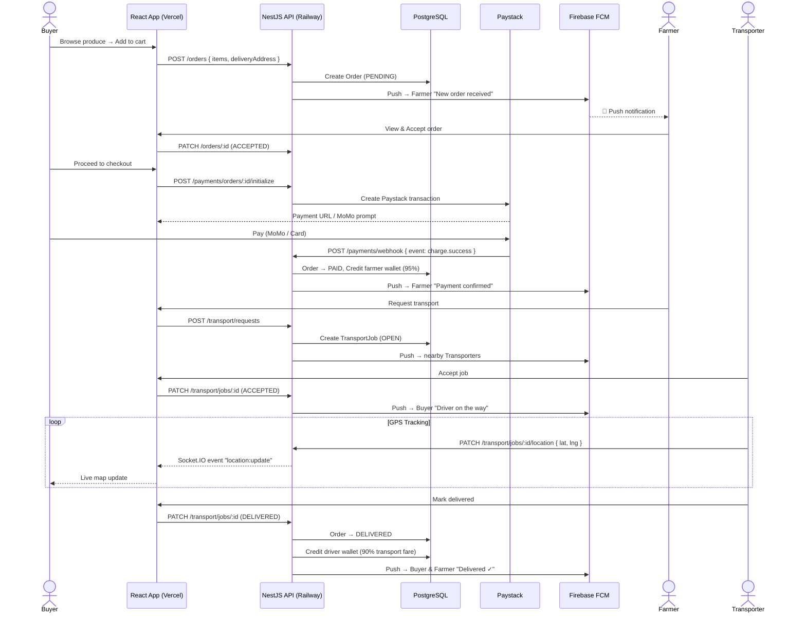

---

### AI Crop Scan Flow

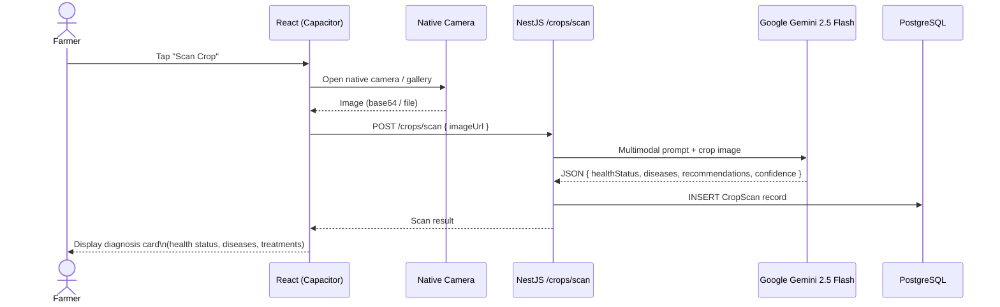

---

### Real-Time Chat & Push Notifications

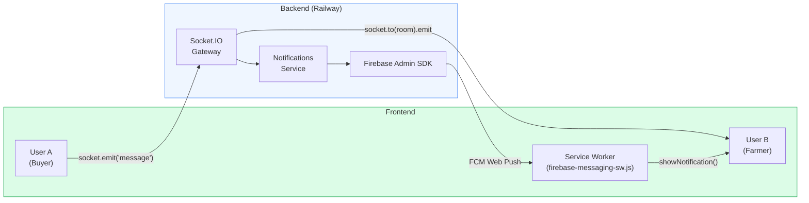

---

### USSD Flow (Basic Phone)

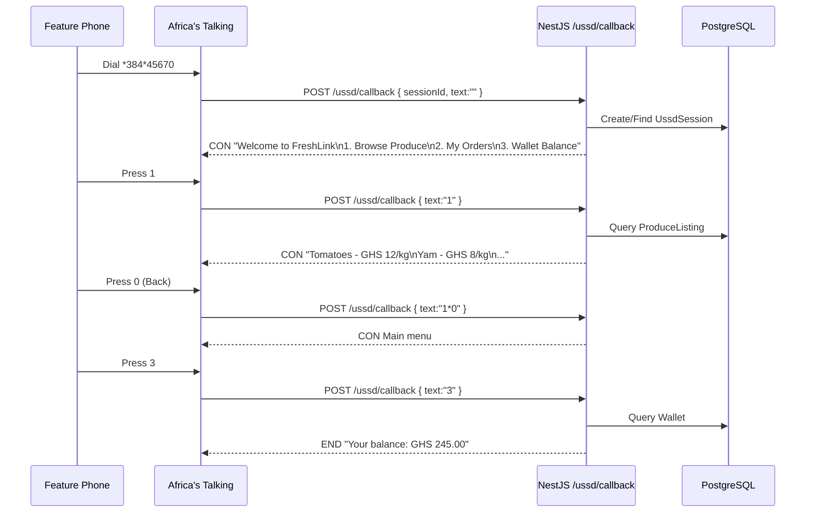

---

## 5. Database Schema

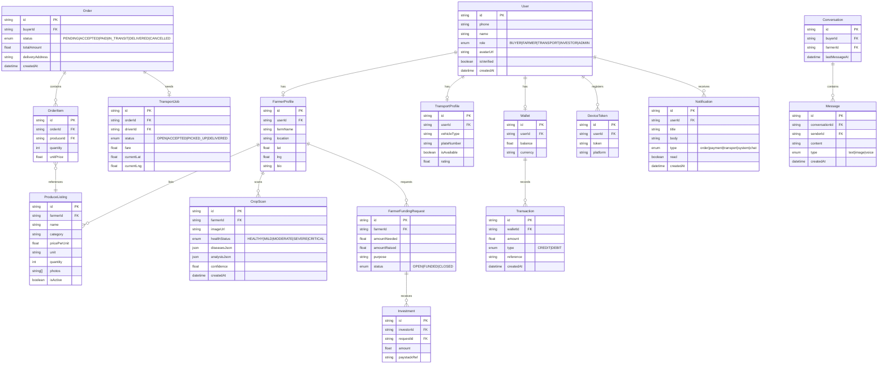

---

## 6. App Screenshots & Flows

> **Live App:** [fresh-link-weld.vercel.app](https://fresh-link-weld.vercel.app)

### Onboarding & Auth Flow

| Splash | Onboarding | Role Select | Login |
|--------|-----------|-------------|-------|
|  |  |  |  |

*Users see the splash screen → animated onboarding carousel → role selection → OTP-verified login. Biometric (fingerprint / Face ID) login is available on subsequent sessions.*

---

### Buyer Flow

| Home | Search | Cart | Order Tracking |
|------|--------|------|---------------|
|  |  |  |  |

*Buyers browse produce listings with farm locations on a map, add items to cart, pay via Paystack MoMo/Card, then track their delivery in real-time.*

---

### Farmer Flow

| Dashboard | Knowledge Hub | Crop Scan | Wallet |
|-----------|--------------|-----------|--------|
|  |  |  |  |

*Farmers manage listings, process orders, receive AI crop health diagnosis, and withdraw earnings to their mobile money account.*

---

### Transporter Flow

| Dashboard | Available Jobs | Active Delivery |
|-----------|---------------|-----------------|
|  |  |  |

*Transporters toggle availability, accept jobs, navigate via GPS, and track earnings in their wallet.*

---

### AI Crop Scan — Gemini Vision

```
📸 Farmer takes photo → 🧠 Gemini 2.5 Flash analyses → 📋 Diagnosis card
```

The Crop Scan feature uses **Google Gemini multimodal AI** to:
- Detect diseases, pests, and nutrient deficiencies from a single photo
- Return a health status: `HEALTHY` / `MILD` / `MODERATE` / `SEVERE` / `CRITICAL`
- List specific diseases found with confidence scores
- Provide actionable treatment recommendations
- Store every scan in the farmer's history for trend tracking

---

### Gemini AI Chat Assistant

Accessible via the floating **✨ Gemini** button on the Knowledge Hub, the chat assistant is fine-tuned for Ghanaian smallholder farmers:
- Answers questions on crop diseases, soil health, irrigation, and planting calendars
- Responds to Ghana-specific crop varieties and climate conditions
- Redirects off-topic questions back to farming
- Built on `gemini-2.5-flash` with a custom agricultural system prompt

---

## 7. New Features (v2)

### 🌿 AI-Powered Crop Scan
| Detail | Value |
|--------|-------|
| Model | Google Gemini 2.5 Flash (multimodal) |
| Input | Camera photo or gallery image |
| Output | Health status, disease list, confidence score, recommendations |
| Storage | PostgreSQL `CropScan` table per farmer |
| Endpoint | `POST /api/v1/crops/scan` |

### 🤖 Gemini Agricultural Chat
| Detail | Value |
|--------|-------|
| Model | Google Gemini 2.5 Flash (text) |
| System Prompt | Ghana-focused agricultural AI assistant |
| UI | Slide-up sheet with farm field background (framer-motion) |
| Endpoint | `POST /api/v1/crops/chat` |
| Rate limit | 20 requests / 60 seconds per user |

### 🌙 Dark Mode
- Class-based dark mode (`darkMode: 'class'` in Tailwind)
- CSS variables flip between light (`#F4F1EA` bg) and dark (`#0F1C14` bg) palettes
- Toggle lives in the **Dashboard Hero** (top of every role dashboard), next to the bell icon
- Animated custom switch (grey → green pill with X / checkmark icons)
- Persisted in Zustand store

### 🔐 Biometric Login
- Uses `@aparajita/capacitor-biometric-auth`
- Supports **fingerprint**, **Face ID**, and **iris** on Android / iOS
- Available only on native Capacitor builds; fingerprint button shown only when enrolled
- Falls back gracefully to password login

### 🔔 Rich Push Notifications
- **Web push** via Firebase FCM + Service Worker (`firebase-messaging-sw.js`)
- **Android native push** via `@capacitor/push-notifications`
- Notifications include: app icon, Fresh-Link logo, vibration pattern
- **Foreground notifications** use `registration.showNotification()` to display OS banners even when app is open
- Stored notification cards show app logo watermark
- Real-time toast banners (`sonner` `toast.custom()`) for in-app arrival

---

## 8. Tech Stack

### Frontend

| Technology | Purpose |
|-----------|---------|
| **React 18** | UI framework |
| **TypeScript** | Type safety |
| **Vite** | Build tool |
| **Tailwind CSS** | Styling (with class-based dark mode) |
| **TanStack Query v5** | Server state, caching, mutations |
| **Zustand** | Client state (auth, theme, cart) |
| **Capacitor 6** | Native Android/iOS bridge |
| **framer-motion** | Animations (sheets, transitions) |
| **Socket.IO client** | Real-time chat & GPS |
| **React Router v6** | HashRouter (Capacitor compatible) |
| **Lucide React** | Icon system |
| **sonner** | Toast notifications |
| **i18next** | 5 languages (EN, Twi, Hausa, Ewe, Ga) |

### Backend

| Technology | Purpose |
|-----------|---------|
| **NestJS 10** | API framework |
| **Prisma ORM** | Database access |
| **PostgreSQL 15** | Primary database |
| **Socket.IO** | Real-time WebSocket gateway |
| **Passport JWT** | Authentication guards |
| **class-validator** | DTO validation |
| **Swagger** | Auto-generated API docs |
| **firebase-admin** | FCM push notifications |
| **@google/generative-ai** | Gemini Vision + Chat API |
| **Africa's Talking SDK** | SMS OTP + USSD |
| **Paystack** | Payment processing + webhooks |
| **Throttler** | Rate limiting |

### Native Capacitor Plugins

| Plugin | Purpose |
|--------|---------|
| `@capacitor/camera` | Crop scan photo capture |
| `@capacitor/push-notifications` | Native FCM push |
| `@capacitor/haptics` | Tactile feedback |
| `@capacitor/network` | Offline detection |
| `@capacitor/splash-screen` | Native splash |
| `@capacitor/status-bar` | Status bar styling |
| `@aparajita/capacitor-biometric-auth` | Fingerprint / Face ID |

---

## 9. Application Map

**82 routes** across 6 role namespaces.

### Auth & Onboarding
```
/splash → /onboarding → /language → /role-select
  → /login → /otp → /register → /forgot-password
```

### Buyer (18 screens)
```
/buyer/home          Browse produce (guest OK)
/buyer/search        Search + filter
/buyer/product/:id   Product detail
/buyer/farmer/:id    Farmer profile
/buyer/compare       Side-by-side produce compare
/buyer/map           Geo map of all listings
/buyer/cart          Shopping cart
/buyer/checkout      Paystack payment
/buyer/orders        Order history
/buyer/tracking/:id  Live GPS tracking
/buyer/chat          Chat inbox
/buyer/chat/:id      Conversation thread
/buyer/favorites     Saved produce
/buyer/farmers       Browse all farmers
/buyer/notifications Notification centre
/buyer/invoice/:id   Downloadable invoice
```

### Farmer (14 screens)
```
/farmer/dashboard    Sales overview + dark mode toggle
/farmer/produce      My listings
/farmer/add-produce  Add new listing
/farmer/edit/:id     Edit listing
/farmer/orders       Incoming orders
/farmer/wallet       Earnings + payout
/farmer/reviews      Customer reviews
/farmer/insights     Charts & analytics
/farmer/knowledge    Knowledge hub + Gemini chat FAB
/farmer/crop-scan    AI crop health scanner
/farmer/funding      Investor funding requests
/farmer/transport    Request transport
/farmer/chat         Chat inbox
/farmer/notifications Notification centre
```

### Transporter (11 screens)
```
/transport/dashboard   Jobs overview
/transport/jobs        Available jobs
/transport/active/:id  Active delivery + GPS
/transport/navigation  Turn-by-turn navigation
/transport/completed   Delivery history
/transport/earnings    Earnings breakdown
/transport/vehicle     Vehicle profile
/transport/availability Toggle availability
/transport/wallet      Wallet + payout
/transport/ratings     Customer ratings
/transport/notifications Notification centre
```

### Investor (2 screens)
```
/investor/dashboard   Portfolio overview
/investor/invest/:id  Fund a farmer (Paystack)
```

### Admin (7 screens)
```
/admin/dashboard      Platform metrics
/admin/users          User management (verify / suspend)
/admin/marketplace    Listing monitor
/admin/reports        Exportable reports
/admin/support        Dispute resolution
/admin/payments       Payment oversight
/admin/register       Admin onboarding (gated by ADMIN_SETUP_CODE)
```

### Shared (14 screens)
```
/settings             Main settings
/settings/profile     Edit profile + avatar
/settings/farm        Farm profile (farmers)
/settings/security    Password + biometric
/settings/notifications Push + preferences
/settings/payments    Saved payment methods
/settings/addresses   Address book
/help                 Help centre
/about                About FreshLink
/terms                Terms of service
/privacy              Privacy policy
/ussd                 USSD simulator
/chat/:id             Chat contact profile
```

---

## 10. Key User Flows

### Buyer: Purchase to Delivery

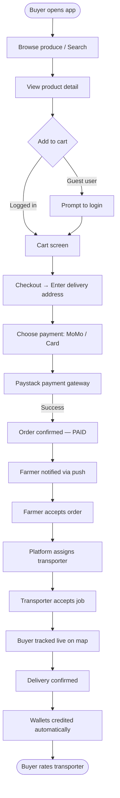

---

### Farmer: Crop Scan to Treatment

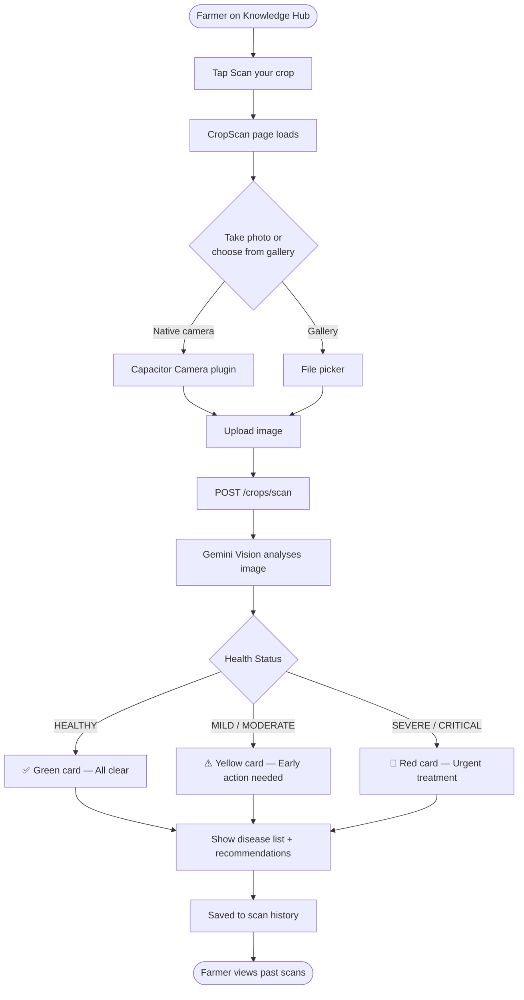

---

### Transporter: Job Acceptance to Payment

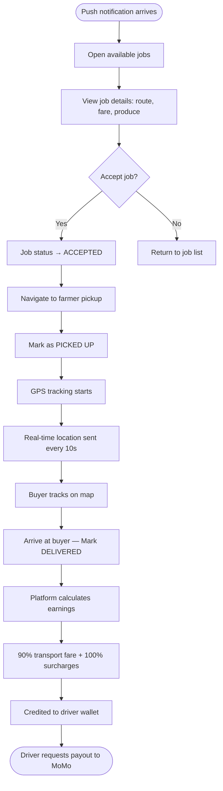

---

### Wallet & Payout Split

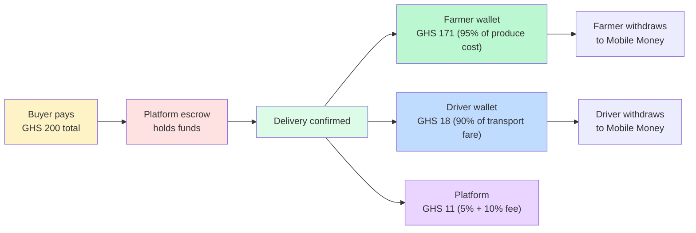

---

## 11. Deployment

### Frontend — Vercel

**Production URL:** [https://fresh-link-weld.vercel.app](https://fresh-link-weld.vercel.app)

- Auto-deploys on every push to `main` branch via GitHub integration
- Project: `fresh-link` · Team: `fresh-linkgh`
- Fallback CLI deploy: `vercel --prod --yes --no-wait`
- Commit author must be `uplifttechGhana <uplifttechgh@gmail.com>` (Vercel Hobby blocks other authors)

### Backend — Railway

**Production URL:** [https://fresh-link-production.up.railway.app](https://fresh-link-production.up.railway.app)

- Auto-deploys on every push to `main` branch
- Root directory: `backend`
- Includes Prisma migrations on deploy

```bash
# Verify backend health
curl https://fresh-link-production.up.railway.app/api/v1/health
```

### CI/CD Flow

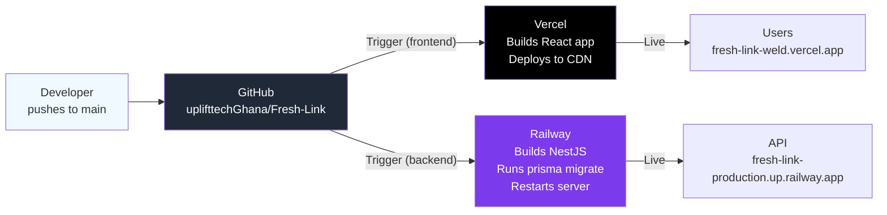

---

## 12. Environment Variables

### Frontend (`.env` — baked in at build time)

| Variable | Description | Example |
|----------|-------------|---------|
| `VITE_API_BASE_URL` | Backend URL (browser) | `https://fresh-link-production.up.railway.app/api/v1` |
| `VITE_API_BASE_URL_NATIVE` | Backend URL (APK) | `http://127.0.0.1:3001/api/v1` |
| `VITE_PAYSTACK_PUBLIC_KEY` | Paystack public key | `pk_live_...` |
| `VITE_USSD_SHORTCODE` | USSD dial code | `*384*45670#` |
| `VITE_FIREBASE_API_KEY` | Firebase config | `AIza...` |
| `VITE_FIREBASE_AUTH_DOMAIN` | Firebase domain | `project.firebaseapp.com` |
| `VITE_FIREBASE_PROJECT_ID` | Firebase project | `freshlink-xyz` |
| `VITE_FIREBASE_MESSAGING_SENDER_ID` | FCM sender | `123456789` |
| `VITE_FIREBASE_APP_ID` | Firebase app | `1:123:web:abc` |
| `VITE_FIREBASE_VAPID_KEY` | Web push VAPID | `BF8...` |
| `VITE_SENTRY_DSN` | Sentry error tracking | `https://...@sentry.io/...` |

### Backend (`backend/.env`)

| Variable | Description |
|----------|-------------|
| `DATABASE_URL` | PostgreSQL connection string |
| `JWT_ACCESS_SECRET` | Access token signing key (≥64 chars) |
| `JWT_REFRESH_SECRET` | Refresh token signing key (≥64 chars) |
| `AFRICASTALKING_API_KEY` | Africa's Talking API key |
| `AFRICASTALKING_USERNAME` | `sandbox` or production username |
| `AFRICASTALKING_SHORTCODE` | USSD/SMS shortcode |
| `PAYSTACK_SECRET_KEY` | Paystack server secret (`sk_live_...`) |
| `PAYSTACK_WEBHOOK_SECRET` | Webhook HMAC secret |
| `CLOUDINARY_CLOUD_NAME` | Cloudinary account |
| `CLOUDINARY_API_KEY` | Cloudinary key |
| `CLOUDINARY_API_SECRET` | Cloudinary secret |
| `FIREBASE_PROJECT_ID` | Firebase project ID |
| `FIREBASE_CLIENT_EMAIL` | Firebase service account email |
| `FIREBASE_PRIVATE_KEY` | Firebase service account key |
| `GEMINI_API_KEY` | Google Gemini API key |
| `ADMIN_PHONES` | Comma-separated admin phone numbers |
| `ADMIN_SETUP_CODE` | Secret for `/admin/register` endpoint |
| `FRONTEND_URL` | Frontend URL for push notification links |
| `SENTRY_DSN` | Sentry backend DSN |

---

## 13. Local Development

### Prerequisites

- Node 20+
- PostgreSQL 15+ (`freshlink` database)
- Africa's Talking sandbox account (SMS OTP + USSD)
- Paystack test account
- Google AI Studio account (Gemini API key)
- Firebase project with FCM enabled

### Frontend

```bash
git clone https://github.com/uplifttechGhana/Fresh-Link.git
cd Fresh-Link
npm install
cp .env.example .env
# Fill in .env values
npm run dev          # → http://localhost:5173
```

### Backend

```bash
cd backend
npm install
cp .env.example .env
# Fill in .env values (DATABASE_URL, JWT secrets, etc.)
npm run prisma:generate
npm run prisma:migrate
PORT=3001 npm run start:dev    # → http://localhost:3001/api/v1
# Swagger docs → http://localhost:3001/api/docs
```

### Run Both Together

```bash
# Terminal 1 — backend
cd backend && npm run start:dev

# Terminal 2 — frontend
npm run dev
```

---

## 14. Capacitor / APK Build

### Development APK

```bash
# 1. Build the React app
npm run build

# 2. Sync to Android project
npm run cap:sync

# 3. For USB debugging — forward backend port
adb reverse tcp:3001 tcp:3001

# 4. Build debug APK
cd android && ./gradlew assembleDebug

# 5. Install on connected device
adb install -r app/build/outputs/apk/debug/app-debug.apk
```

### Production APK (Release)

```bash
cd android && ./gradlew assembleRelease
# Sign with your keystore before distributing
```

### Open in Android Studio

```bash
npm run cap:open:android
```

### Capacitor Config

| Setting | Value |
|---------|-------|
| App ID | `com.freshlink.app` |
| App Name | `FreshLink` |
| Router | `HashRouter` (required for Capacitor) |
| Web Dir | `dist` |

### Native Capabilities Enabled

| Capability | Description |
|-----------|-------------|
| Camera | Crop scan photo capture |
| Push Notifications | FCM via `@capacitor/push-notifications` |
| Biometric Auth | Fingerprint / Face ID login |
| Haptics | Tactile feedback on interactions |
| Network Detection | Offline banner + graceful degradation |
| Splash Screen | Native branded splash |
| Status Bar | Transparent overlay styling |

---

## 15. Security

| Concern | Implementation |
|---------|----------------|
| **Authentication** | JWT access (15 min) + refresh tokens (7 days) |
| **Password hashing** | bcrypt (12 rounds) |
| **OTP login** | 6-digit, 5-min expiry, 3/min rate limit via Africa's Talking |
| **Role guards** | NestJS `@Roles()` decorator on every endpoint |
| **Payment integrity** | Paystack webhook HMAC-SHA512 verification |
| **Admin access** | Gated by `ADMIN_SETUP_CODE` env var |
| **API rate limiting** | `@nestjs/throttler` — 100 req/min global, tighter on auth/AI |
| **Secrets** | All in `.env` — never committed |
| **Dev OTP bypass** | Disabled in production |
| **Biometric** | Local device-only, no biometric data leaves the phone |
| **CORS** | Restricted to known frontend origins |

---

## 16. Development Status

| Feature | Status | Notes |
|---------|--------|-------|
| Auth (JWT + SMS OTP) | ✅ Complete | |
| Biometric login (fingerprint / Face ID) | ✅ Complete | Native only |
| Buyer flow (browse → Paystack → track) | ✅ Complete | |
| Farmer flow (listings, orders, wallet) | ✅ Complete | |
| Transport flow (jobs, GPS, earnings) | ✅ Complete | |
| Investor flow | ✅ Complete | |
| Admin dashboard | ✅ Complete | |
| Real-time chat (WebSocket) | ✅ Complete | |
| Rich push notifications (FCM) | ✅ Complete | Web + Android |
| Foreground push banners | ✅ Complete | Service worker + toast |
| USSD gateway (Africa's Talking) | ✅ Complete | |
| SMS OTP (Africa's Talking) | ✅ Complete | |
| AI Crop Scan (Gemini Vision) | ✅ Complete | |
| Gemini AI Chat Assistant | ✅ Complete | |
| Dark Mode | ✅ Complete | CSS variables + Tailwind |
| i18n (5 languages) | ✅ Complete | EN, Twi, Hausa, Ewe, Ga |
| Capacitor Android APK | ✅ Complete | |
| Knowledge Hub | ✅ Complete | Videos + articles |
| Investor Funding | ✅ Complete | |
| Wallet & Payouts | ✅ Complete | |
| iOS native project | ❌ Not yet | Android-first |
| USSD ordering | ❌ By design | Browse-only via USSD |
| WhatsApp notifications | ❌ Not integrated | |
| Server-side cart | ❌ Client-side only | |

---

## Monorepo Structure

```
Fresh-Link/
├── src/                          # React frontend
│   ├── pages/
│   │   ├── auth/                 # Splash, Onboarding, Login, Register, OTP
│   │   ├── buyer/                # 18 buyer screens
│   │   ├── farmer/               # 14 farmer screens (+ CropScan)
│   │   ├── transport/            # 11 transporter screens
│   │   ├── investor/             # 2 investor screens
│   │   ├── admin/                # 7 admin screens
│   │   └── shared/               # 14 shared screens (settings, help, USSD)
│   ├── components/
│   │   ├── ui/                   # DashboardHero, TopBar, Card, Button,
│   │   │                         # GeminiChatSheet, DarkModeToggle, ...
│   │   ├── admin/                # AdminShell, AdminSubHeader
│   │   ├── buyer/                # DeliveryAddressSheet, PaymentMethodSheet
│   │   ├── chat/                 # VoiceMessage
│   │   ├── transport/            # TransportMap
│   │   └── wallet/               # PayoutSheets
│   ├── lib/
│   │   ├── api.ts                # Axios client + error formatting
│   │   ├── hooks/                # 28 custom hooks
│   │   │   ├── useCropScan.ts    # AI crop scan + history
│   │   │   ├── useGeminiChat.ts  # Gemini chat
│   │   │   ├── useBiometric.ts   # Biometric auth
│   │   │   ├── usePushNotifications.ts
│   │   │   └── ...
│   │   ├── push/                 # registerPush.ts
│   │   └── store.ts              # Zustand (auth, theme, cart)
│   └── index.css                 # CSS variables (light + dark tokens)
│
├── backend/                      # NestJS API
│   ├── src/
│   │   ├── auth/                 # JWT, OTP, guards
│   │   ├── crop-scan/            # Gemini Vision + chat
│   │   │   ├── gemini.service.ts
│   │   │   ├── crop-scan.service.ts
│   │   │   └── crop-scan.controller.ts
│   │   ├── notifications/        # FCM push
│   │   ├── orders/               # Order lifecycle
│   │   ├── payments/             # Paystack webhooks
│   │   ├── transport/            # Jobs + GPS
│   │   ├── wallet/               # Balances + payouts
│   │   ├── chat/                 # WebSocket gateway
│   │   ├── ussd/                 # AT USSD state machine
│   │   ├── produce/              # Marketplace listings
│   │   ├── investor/             # Funding requests
│   │   ├── knowledge/            # Hub articles
│   │   ├── admin/                # Platform admin
│   │   ├── users/                # Profile management
│   │   ├── storage/              # File upload
│   │   └── sms/                  # Africa's Talking SMS
│   └── prisma/
│       └── schema.prisma         # 32 models
│
├── android/                      # Capacitor Android project
├── public/
│   ├── firebase-messaging-sw.js  # Background push handler
│   ├── app-icon-192.png
│   └── freshlink-logo.png
├── docs/
│   └── screenshots/              # App screenshots for docs
├── tailwind.config.js
├── capacitor.config.ts
└── README.md
```

---

## Further Reading

| Document | Contents |
|----------|----------|
| **[DOCUMENTATION.md](DOCUMENTATION.md)** | Full system docs — all screens, flows, API reference |
| **[PRODUCTION.md](PRODUCTION.md)** | Production deploy checklist |
| **[backend/.env.example](backend/.env.example)** | All backend env variables |
| **[.env.example](.env.example)** | All frontend env variables |
| **[Swagger API Docs](https://fresh-link-production.up.railway.app/api/docs)** | Live interactive API reference |

---

<div align="center">

**Built with ❤️ for Ghanaian farmers by [Uplift Technologies](https://github.com/uplifttechGhana)**

[](https://fresh-link-weld.vercel.app)

*Private — Uplift Technologies / FreshLink*

</div>
