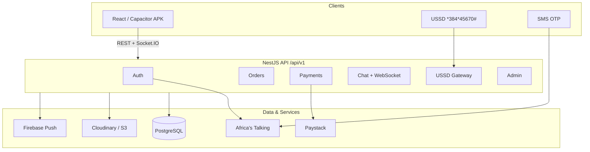
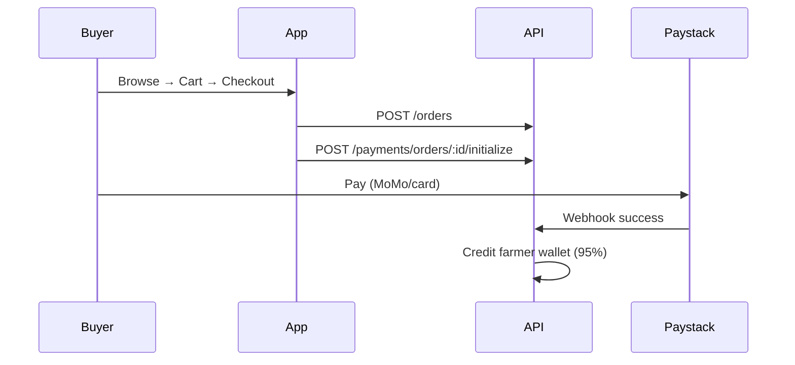
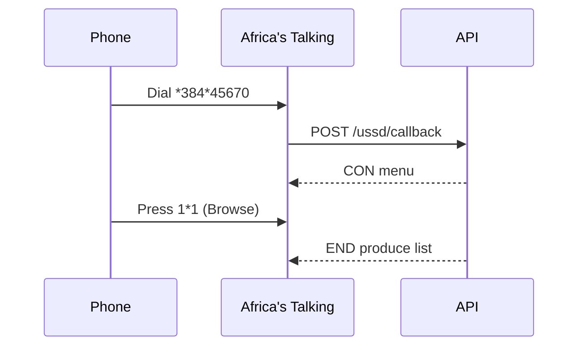
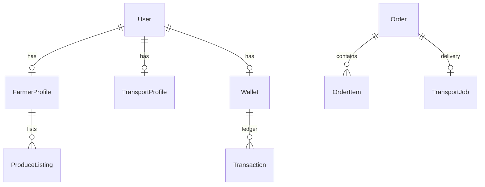

# FreshLink

Ghana agricultural marketplace — React + NestJS + PostgreSQL + Capacitor.

Connects **buyers**, **farmers**, **transporters**, **investors**, and **admins** through a mobile-first app, with **USSD** and **SMS** for users on basic phones.

📖 **[Full Documentation → DOCUMENTATION.md](DOCUMENTATION.md)** — architecture, every screen, user flows, API reference, diagrams.

---

## What FreshLink Does

| Role | Capabilities |
|------|-------------|
| **Buyer** | Browse produce, cart, Paystack checkout, track delivery, chat, favorites |
| **Farmer** | List produce, manage orders, wallet/payouts, insights, knowledge hub, funding |
| **Transport** | Accept jobs, GPS navigation, earnings, availability toggle |
| **Investor** | Fund farmer requests via Paystack |
| **Admin** | Users, marketplace monitor, reports, disputes, payments |
| **USSD** | Browse prices, orders, wallet on basic GSM (`*384*45670#`) |
| **SMS** | OTP login via Africa's Talking |

---

## Monorepo Structure

```
Fresh-Link/
├── src/                    # React frontend (Vite + TypeScript + Tailwind)
│   ├── pages/              # 71 pages across 7 role folders
│   ├── components/         # Shared UI (BottomNav, AdminShell, maps, chat)
│   └── lib/                # API client, hooks (25), stores, i18n
├── backend/                # NestJS API (21 controllers, ~100 endpoints)
│   ├── src/                # 25 modules (auth, orders, ussd, chat, etc.)
│   └── prisma/             # PostgreSQL schema
├── android/                # Capacitor Android project
├── DOCUMENTATION.md        # Complete system documentation
└── README.md               # This file
```

---

## Quick Start

### Prerequisites

- Node 20+
- PostgreSQL 15+ (`freshlink` database)
- (Optional) [Africa's Talking](https://africastalking.com) sandbox — SMS OTP + USSD
- (Optional) [Paystack](https://paystack.com) test account
- (Optional) [ngrok](https://ngrok.com) — USSD callback testing

### Frontend

```bash
npm install
cp .env.example .env
npm run dev          # http://localhost:5173
```

### Backend

```bash
cd backend
npm install
cp .env.example .env
npm run prisma:generate
npm run prisma:migrate
PORT=3001 npm run start:dev    # http://localhost:3001/api/v1
```

**API docs:** http://localhost:3001/api/docs

### Phone / APK Testing

```bash
adb reverse tcp:3001 tcp:3001
npm run build && npm run cap:sync
cd android && ./gradlew assembleDebug
adb install -r app/build/outputs/apk/debug/app-debug.apk
```

---

## Architecture



### Tech Stack

| Layer | Stack |
|-------|-------|
| Frontend | React 18, TypeScript, Vite, Tailwind, TanStack Query, Zustand, Capacitor 6 |
| Backend | NestJS 10, Prisma, PostgreSQL, Socket.IO, Swagger |
| Auth | JWT + OTP (Africa's Talking SMS) |
| Payments | Paystack (checkout + webhooks + withdrawals) |
| Real-time | WebSocket chat + Firebase push |
| USSD | Africa's Talking webhook state machine |
| i18n | English, Twi, Hausa, Ewe, Ga |

---

## Application Map

**77 routes** across 5 roles. Full per-screen documentation in [DOCUMENTATION.md §9](DOCUMENTATION.md#9-application-sections-complete).

### Auth & Onboarding
`Splash` → `Onboarding` → `Language` → `RoleSelect` → `Login` / `Register` → `OTP`

### Buyer (17 screens)
Browse (guest OK): Home, Search, Product, Farmer Profile, Compare, Map, Cart, Farmers  
Authenticated: Checkout, Orders, Favorites, Tracking, Chat, Invoice, Notifications, Saved Farmers

### Farmer (13 screens)
Dashboard, Produce (add/edit), Orders, Wallet, Reviews, Insights, Knowledge Hub, Funding, Transport Request, Chat

### Transport (11 screens)
Dashboard, Jobs, Active Delivery, Navigation, Earnings, Vehicle, Availability, Wallet, Ratings, Chat

### Investor (2 screens)
Dashboard, Invest (Paystack)

### Admin (7 screens)
Dashboard, Users, Marketplace Monitor, Reports, Support, Payments (+ public Register)

### Shared (13 screens)
Settings suite, Help, Legal, USSD Simulator, Chat Contact Profile

---

## Key User Flows

### Buyer Purchase



### USSD (Basic Phone)



**USSD is browse-only** — ordering happens in the app.

---

## Environment Variables

### Frontend (`.env` — baked in at APK build)

| Variable | Description |
|----------|-------------|
| `VITE_API_BASE_URL` | Backend URL (browser dev) |
| `VITE_API_BASE_URL_NATIVE` | Backend URL (APK — use `http://127.0.0.1:3001` + adb reverse) |
| `VITE_PAYSTACK_PUBLIC_KEY` | Paystack public key |
| `VITE_USSD_SHORTCODE` | USSD dial code (default `*384*12345#`) |
| `VITE_FIREBASE_*` | Web push notifications |
| `VITE_SENTRY_DSN` | Frontend error tracking |

### Backend (`backend/.env`)

| Variable | Description |
|----------|-------------|
| `DATABASE_URL` | PostgreSQL connection string |
| `JWT_ACCESS_SECRET` / `JWT_REFRESH_SECRET` | Token signing (≥64 chars) |
| `AFRICASTALKING_API_KEY` | SMS API key |
| `AFRICASTALKING_USERNAME` | `sandbox` or live username |
| `AFRICASTALKING_SHORTCODE` | USSD code (e.g. `*384*45670#`) |
| `PAYSTACK_SECRET_KEY` | Paystack server key |
| `PAYSTACK_WEBHOOK_SECRET` | Webhook HMAC verification |
| `CLOUDINARY_*` / `STORAGE_*` | File uploads |
| `FIREBASE_*` | Push notifications |
| `ADMIN_PHONES` | Auto-promote to admin on boot |
| `ADMIN_SETUP_CODE` | Secret for `/admin/register` |
| `SENTRY_DSN` | Backend error tracking |

---

## Capacitor (Android / iOS)

```bash
npm run build
npm run cap:sync
npm run cap:open:android    # Android Studio
npm run cap:run:android     # Direct to device
```

| Setting | Value |
|---------|-------|
| App ID | `com.freshlink.app` |
| Router | HashRouter (required for Capacitor) |
| Native plugins | Camera, Push, Haptics, Network, Splash, StatusBar |

---

## USSD & SMS Setup

### SMS (OTP Login)

1. Sign up at [Africa's Talking](https://account.africastalking.com) → Sandbox
2. Generate API key → set `AFRICASTALKING_API_KEY` in `backend/.env`
3. Sandbox → Launch Simulator → connect test phone
4. PIN appears in Simulator SMS tab (not on real phone in sandbox)

```bash
cd backend && npm run test:sms -- +233XXXXXXXXX
```

### USSD (Basic Phone Access)

1. Create channel in AT Sandbox → USSD → Service Codes
2. Callback URL: `https://YOUR_PUBLIC_URL/api/v1/ussd/callback`
3. Local dev: `ngrok http 3001` → use ngrok URL as callback
4. Test via AT Sandbox → **Launch Simulator** (not developers.africastalking.com)
5. Dial your shortcode (e.g. `*384*45670#`)

In-app simulator also available at `/#/ussd`.

---

## API Overview

**Base:** `/api/v1` · **Docs:** `/api/docs` · **Auth:** Bearer JWT

| Module | Endpoints | Purpose |
|--------|-----------|---------|
| `/auth` | register, login, otp, refresh | Authentication |
| `/produce` | browse, CRUD, favorites | Marketplace listings |
| `/orders` | create, status, cancel, invoice | Order lifecycle |
| `/payments` | initialize, webhook | Paystack integration |
| `/transport` | jobs, accept, GPS | Delivery management |
| `/wallet` | balance, withdraw | Earnings & payouts |
| `/chat` | conversations, messages | Messaging |
| `/ussd` | callback, simulate | USSD gateway |
| `/admin` | stats, users, disputes | Platform admin |
| `/investor` | funding, investments | Crowdfunding |
| `/integrations` | AT status | Integration health |

Full endpoint list: [DOCUMENTATION.md §11](DOCUMENTATION.md#11-backend-api-reference)

---

## Database

PostgreSQL via Prisma. Key entities:



Full schema: [DOCUMENTATION.md §6](DOCUMENTATION.md#6-database-design)

---

## Development Status

| Area | Status |
|------|--------|
| Auth (JWT + OTP) | ✅ Complete |
| Buyer flow (browse → Paystack → track) | ✅ Complete |
| Farmer flow (listings, orders, wallet) | ✅ Complete |
| Transport flow (jobs, GPS, earnings) | ✅ Complete |
| Investor flow | ✅ Complete |
| Admin dashboard | ✅ Complete |
| Real-time chat (WebSocket) | ✅ Complete |
| Push notifications (FCM) | ✅ Complete |
| USSD gateway (AT sandbox) | ✅ Complete |
| SMS OTP (AT sandbox) | ✅ Complete |
| i18n (5 languages) | ✅ Complete |
| Capacitor Android APK | ✅ Complete |
| USSD ordering | ❌ Browse-only (by design) |
| WhatsApp notifications | ❌ Not integrated |
| iOS native project | ❌ Not added yet |
| Server-side cart API | ❌ Client-side only |

---

## Security

- bcrypt passwords · JWT access + refresh · role-based guards
- OTP rate-limited (3/min) · Paystack webhook HMAC
- Admin gated by `ADMIN_SETUP_CODE` · secrets in `.env` only
- Dev OTP endpoint disabled in production

---

## Further Reading

| Document | Contents |
|----------|----------|
| **[DOCUMENTATION.md](DOCUMENTATION.md)** | Complete system docs — all 71 screens, flows, diagrams, API, deployment |
| **[PRODUCTION.md](PRODUCTION.md)** | Vercel + Railway staging deploy (copy your existing env vars) |
| [backend/.env.example](backend/.env.example) | All backend env vars |
| [.env.example](.env.example) | All frontend env vars |
| `/api/docs` | Live Swagger API reference |

---

## License

Private — Uplift Technologies / FreshLink.
